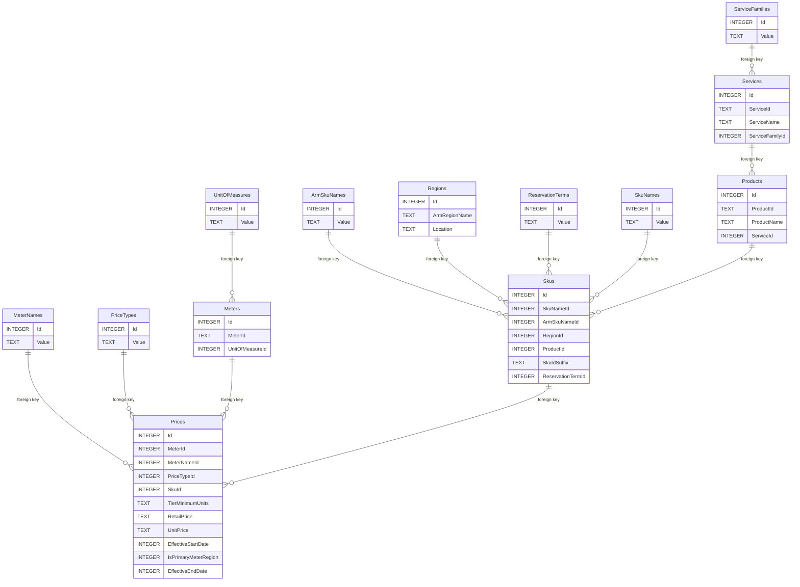

# az-retail-prices

## Data properties

### Optional properties

Can be missing from the JSON:

- `reservationTerm`
- `effectiveEndDate`

Can be empty strings:

- `armRegionName`
- `location`
- `armSkuName`

### Natural keys

The combination of the following properties is a natural key (unique) for the Azure Retail Prices items.

- `meterId`
- `meterName`
- `priceType`
- `skuId`
- `tierMinimumUnits`

### Relationships between properties

These are just the string properties.

Implies:
- `meterId` ⇒ `unitOfMeasure`
- `productId` ⇒ `serviceName`
- `productId` ⇒ `serviceId`
- `productId` ⇒ `serviceFamily`
- `productName` ⇒ `serviceName`
- `productName` ⇒ `serviceId`
- `productName` ⇒ `serviceFamily`
- `serviceId` ⇒ `serviceFamily`
- `serviceName` ⇒ `serviceFamily`
- `skuId` ⇒ `armRegionName`
- `skuId` ⇒ `location`
- `skuId` ⇒ `productId`
- `skuId` ⇒ `productName`
- `skuId` ⇒ `skuName`
- `skuId` ⇒ `serviceName`
- `skuId` ⇒ `serviceId`
- `skuId` ⇒ `serviceFamily`
- `skuId` ⇒ `armSkuName`
- `skuId` ⇒ `reservationTerm`

Note that `currencyCode` property is a constant value based on the `currencyCode` query parameter. It was excluded from
this list since it's not interesting.

Equivalencies:
- `armRegionName` ⇔ `location`
- `productId` ⇔ `productName`
- `serviceId` ⇔ `serviceName`

### Diagram

